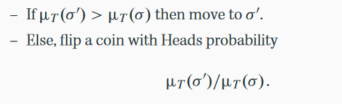
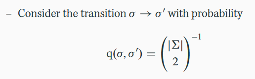

Quick Test
==========

To test run the following python command.

`python run_deciphering.py -i data/warpeace_input.txt -d secret_message.txt` 

To scramble a text message contained in filename run:

`python scramble_text.py -i filename > output`

How to run the code
===================

Well, if you already happen to have an encoded text and wish to decode it, all you need to be concerned with `run_deciphering.py`.
Typing `python run_deciphering.py -h` would show

Usage: run_deciphering.py [options]

Options:

  -h, --help ........... show this help message and exit

  -i INPUTFILE, --input=INPUTFILE .......... input file to train the code on

  -d DECODE, --decode=DECODE .......... file that needs to be decoded

  -e ITERATIONS, --iters=ITERATIONS ........... number of iterations to run the algorithm for

  -t TOLERANCE, --tolerance=TOLERANCE .......... percentate acceptance tolerance, before we should stop

  -p PRINT_EVERY, --print_every=PRINT_EVERY ...........number of steps after which diagnostics should be printed

Code Walkthrough
============================
The code given does correspond to our algorithm, even though the similarities may not be directly obvious.  The following correspondences might be helpful.

* The entire decision on state updating given by  
  
is handled by the line: `if p2-p1 > np.log(u)` in the `metropolis_hastings.py` file.  Note that $u$ is a random variable sampled uniformly from $(0,1)$.

* This code was written by what seems to be a software engineer.  As such, many of the operations are extracted to their own methods to be as generic as possible.  It is, for instance, possible to pass in a different way to create permutations.  First, lets understand how `metropolis_hastings` knows what it needs to do this.  `metropolis_hastings` is called in the `run_deciphering.py` file (the one you actually run in python).  In it, you see: 

`metropolis_hastings(initial_state, proposal_function=propose_a_move, log_density=compute_probability_of_state,iters=iters, print_every=print_every, tolerance=tolerance, pretty_state=pretty_state)`

  In this block, what we care about are `proposal_function` and and `log_density`.  `proposal_function` constructs the permutations, whereas `log_density` assigns a probability to those permutations.  We will cover `log_density` later, because it uses some slight modifications that make it better for the computer. This code roughly corresponds to our definition of $q(\sigma,\sigma')$:
  

* The provided `proposal_function` for the code is given by the method `propose_a_move`, which can be found near the bottom of the `deciphering_utils.py` file.  This example is a simple transposition of two characters from the 56 possible (this code considers all lower and uppercase characters separately).

* The `log_density` method gives what is essentially the log-likelihood of a given state.  It does this via a call to `compute_probability_of_state`, which in turn calls `compute_log_probability_by_counts`, both of which are in the `deciphering_utils.py` file.  `compute_probability_of_state` doesn't do much, so we will examine `compute_log_probability_by_counts`.  In order to understand this, we also need to know how the text is processed.  Currently, whenever you see the variable `transition_matrix` or `transition_probabilities`, that corresponds to a matrix such that the element `transition_matrix[i,j]` is the probabilitiy of character `i` following character `j`.  To know what character corresponds to what index, the author has created the method `char_to_ix`. e.g. suppose we want to know the probability that $a$ followed $b$.  We would simply use `transition_matrix[char_to_ix(a)][char_to_ix(b)]`.  `transition_counts` is similar, but collects the un-normalized counts.  

